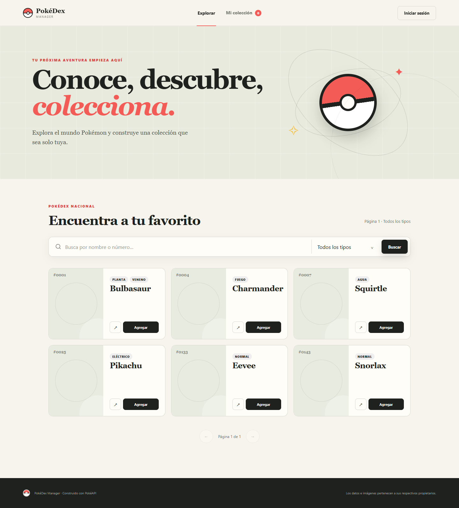
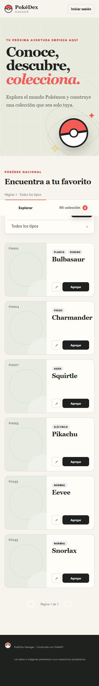

# PokéDex Manager

Aplicación full-stack para explorar la Pokédex y guardar una colección personal. Incluye cuentas de usuario, búsqueda con PokéAPI, favoritos, notas y sugerencias por tipo.

## Vista previa

| Escritorio | Móvil |
| --- | --- |
|  |  |

En **Mi colección** se muestran estadísticas, favoritos, notas y sugerencias para ampliar la cobertura de tipos.

## Inicio rápido

Requisitos: **Node.js 22.5 o superior** y conexión a internet.

```powershell
npm install
Copy-Item .env.example .env
npm start
```

Abre [http://localhost:3000](http://localhost:3000), crea una cuenta con tu correo y comienza a guardar Pokémon. La cuenta queda activa inmediatamente.

Para trabajar con reinicio automático:

```bash
npm run dev
```

Para ejecutar las pruebas:

```bash
npm test
```

### Para quien evalúa el proyecto

No se necesita Docker, un despliegue ni crear un proyecto de Supabase propio. Después de copiar `.env.example` como `.env`, ejecuta `npm install` y `npm start`; la aplicación estará disponible en `http://localhost:3000`.

Puedes iniciar sesión con una cuenta existente o crear una cuenta nueva usando cualquier correo válido y una contraseña de 8 a 128 caracteres. La confirmación de correo está desactivada para esta evaluación, por lo que no se necesita SMTP ni esperar un mensaje antes de iniciar sesión.

## Pruebas

GitHub Actions ejecuta `npm test` y revisa las dependencias en cada `push` y pull request. La configuración está en [`.github/workflows/ci.yml`](.github/workflows/ci.yml).

Las pruebas cubren la validación de datos, las rutas del servidor y los casos principales de Supabase y PokéAPI mediante dobles de prueba.

## Funcionalidades

- Registro, inicio y cierre de sesión.
- Cuentas, contraseñas y sesiones administradas por Supabase Auth.
- Sesiones persistentes mediante cookies `HttpOnly`, rotación de refresh tokens y validación remota.
- Protección contra intentos repetidos de acceso y registro mediante límites temporales.
- Exploración paginada de Pokémon y búsqueda por nombre o número.
- Filtro por los 18 tipos de Pokémon.
- Ficha detallada con tipos, dimensiones, habilidades y estadísticas.
- Colección independiente por usuario.
- Favoritos, notas personales, buscador de colección y resumen estadístico.
- Sugerencias de Pokémon basadas en los tipos que faltan en la colección, disponibles sin claves adicionales.
- Diseño responsive, navegación por teclado, estados de carga, vacíos y errores.
- Caché temporal de PokéAPI para reducir latencia y llamadas repetidas.

## Arquitectura

```text
Navegador (HTML, CSS, JS)
          │
          │ JSON / cookie de sesión
          ▼
Servidor HTTP (Node.js)
   ├── Supabase Auth y validación
   ├── Servicio y caché de PokéAPI ──► PokéAPI
   ├── Sugerencias por cobertura de tipos
   └── Repositorio con RLS ──────► PostgreSQL / Supabase
```

El frontend es una SPA sencilla en HTML, CSS y JavaScript. El servidor separa las rutas, la validación, Supabase y PokéAPI en módulos pequeños. La colección se guarda en PostgreSQL y las reglas RLS de Supabase hacen que cada cuenta vea solo sus propios registros.

### Estructura

```text
public/              Interfaz y recursos estáticos
server/
  index.js           Punto de entrada del servidor
  app.js             Rutas y composición de la aplicación
  config.js          Lectura y normalización de variables de entorno
  recommendations.js Motor de sugerencias por cobertura de tipos
  supabase.js        Supabase Auth y repositorio PostgreSQL con RLS
  pokeapi.js         Integración y caché de PokéAPI
  validation.js      Validación de entradas
  http.js            Utilidades HTTP y archivos estáticos
  rate-limit.js      Límites temporales por IP, cuenta y usuario
  errors.js          Errores HTTP controlados
supabase/
  migrations/        Esquema PostgreSQL, permisos y políticas RLS
test/                Pruebas unitarias y de integración
.github/workflows/   Verificación automática en GitHub Actions
```

## API

| Método | Ruta | Descripción |
|---|---|---|
| `GET` | `/api/health` | Comprobar el estado del servidor |
| `POST` | `/api/auth/register` | Crear una cuenta y comenzar una sesión |
| `POST` | `/api/auth/login` | Iniciar sesión |
| `POST` | `/api/auth/logout` | Cerrar sesión |
| `GET` | `/api/auth/me` | Consultar usuario actual |
| `GET` | `/api/pokemon` | Listar, buscar o filtrar Pokémon |
| `GET` | `/api/pokemon/:nameOrId` | Consultar un Pokémon por nombre o número |
| `GET` | `/api/collection` | Obtener colección y resumen |
| `POST` | `/api/recommendations` | Generar sugerencias para la colección |
| `POST` | `/api/collection/:id` | Agregar Pokémon |
| `PATCH` | `/api/collection/:id` | Editar nota o favorito |
| `DELETE` | `/api/collection/:id` | Quitar Pokémon |

## Configuración

Copia `.env.example` como `.env`. Node carga ese archivo al iniciar. La clave incluida es una clave **publicable** de Supabase; nunca se debe colocar una clave secreta o `service_role` en el repositorio.

| Variable | Valor predeterminado | Uso |
|---|---|---|
| `PORT` | `3000` | Puerto HTTP |
| `SUPABASE_URL` | URL del proyecto | API de Supabase |
| `SUPABASE_PUBLISHABLE_KEY` | Clave publicable | Acceso público controlado por Auth y RLS |
| `AUTH_RATE_LIMIT_WINDOW_MINUTES` | `15` | Ventana para limitar intentos de autenticación |
| `AUTH_LOGIN_MAX_ATTEMPTS` | `5` | Intentos de inicio de sesión permitidos por IP y cuenta |
| `AUTH_REGISTER_MAX_ATTEMPTS` | `3` | Registros permitidos por IP durante la ventana |
| `RECOMMENDATION_WINDOW_MINUTES` | `60` | Ventana del límite de sugerencias por usuario |
| `RECOMMENDATION_MAX_REQUESTS` | `3` | Solicitudes permitidas por usuario durante la ventana |
| `NODE_ENV` | `development` | Activa cookies `Secure` en producción |

La Pokédex, las cuentas, la colección y las sugerencias funcionan con las variables incluidas en `.env.example`; no requieren claves adicionales ni servicios de pago.

## Sugerencias para el equipo

En **Mi colección** se pueden pedir sugerencias sin configurar servicios adicionales. El servidor revisa los tipos guardados y propone hasta tres Pokémon que todavía no estén en la colección. Antes de mostrarlos, consulta PokéAPI para completar sus datos.

- Muestra los tipos que más se repiten.
- Señala tipos que todavía faltan.
- Permite agregar cada sugerencia directamente.

Las sugerencias requieren una sesión y tienen un límite por usuario.

## Uso desde otro equipo

Todos usan el mismo proyecto de Supabase, pero las colecciones no se mezclan. Las políticas RLS filtran las filas con la identidad de la sesión. La clave incluida es publicable y no tiene permisos administrativos.

El proyecto se ejecuta en local. Basta con clonarlo, copiar `.env.example` como `.env`, instalar las dependencias y arrancar el servidor. No requiere Docker ni una instalación local de PostgreSQL.

Supabase aplica los límites del plan actual. Para probar la aplicación normalmente no hace falta cambiar nada; los límites vigentes se pueden consultar en su [página de precios](https://supabase.com/pricing).

### Registro de evaluadores

El registro por correo y contraseña está habilitado. La confirmación de correo está desactivada, así que una cuenta nueva puede iniciar sesión en cuanto se crea. No hace falta configurar SMTP ni pertenecer al proyecto de Supabase. El acceso anónimo sigue desactivado.

## Decisiones técnicas

La interfaz no usa un framework porque el alcance es pequeño y no necesita un proceso de compilación. Node sirve los archivos estáticos y también expone la API.

Se eligió Supabase para reunir autenticación y PostgreSQL en un solo servicio. RLS permite proteger la colección desde la base de datos. El proyecto no usa SQLite ni guarda archivos de base de datos en el repositorio.

Las estadísticas y sugerencias se calculan con reglas simples sobre los tipos guardados, sin servicios adicionales.

## Seguridad y límites

- La aplicación no guarda contraseñas; esa parte la maneja Supabase Auth.
- Las cuentas nuevas exigen contraseñas de 8 a 128 caracteres.
- El registro no necesita confirmación de correo ni SMTP.
- Los intentos repetidos de inicio de sesión y registro devuelven `429` con tiempo de espera.
- Las solicitudes de sugerencias están limitadas por usuario para evitar abuso.
- Los tokens de sesión solo se envían en cookies `HttpOnly`, `SameSite=Lax` y `Secure` en producción.
- La tabla `collection` tiene RLS forzado y políticas separadas de lectura, inserción, actualización y eliminación basadas en `auth.uid()`.
- La clave publicable no puede saltarse las reglas RLS.
- El servidor añade CSP, bloqueo de iframes, protección contra MIME sniffing, HSTS en producción y una política restrictiva de permisos.
- Todos los cuerpos JSON tienen límite de tamaño y los datos se validan antes de persistirlos.
- La aplicación necesita conexión a internet para consultar PokéAPI, Supabase Auth y PostgreSQL.
- El límite de intentos se guarda en memoria y está pensado para una sola instancia local.
